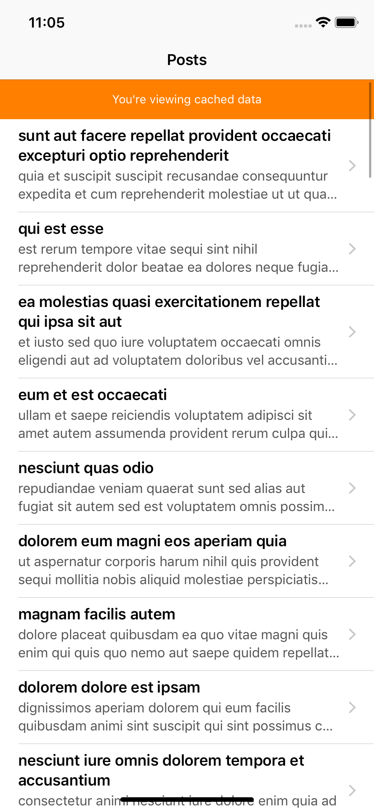
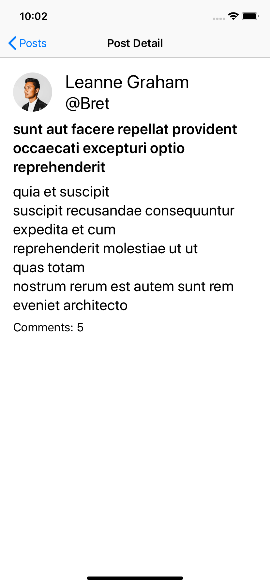

# DDReader Demo Project

by Deniz Adalar (me@dadalar.net)

## Overview

Demo reader application which lets users to view posts and their details. The application has 2 pages as can be seen below.

## Features

- Fetching and showing posts and their details from a remote server.
- Caching data in disk for offline usage.
- Notifying user when they are viewing cached data.
- Pull-to-refresh to trigger data reload.
- Showing an alert when there is no cached data and the fetch failed.
- Dynamic type fonts for enhanced accessibility.
- Universal application (works on iPhone & iPad).

## Architecture & Design Decisions

- MVVM architecture is used to separate business logic from user interface code. View models do not know about how the data will be presented on screen thus can be tested easier.
- View model properties are bound to UI components thanks to RxSwift.
- Interface Builder is not used and all views are created programmatically.
- There was yet no need to separate navigation logic from view controllers but when the project grows it can be separated.
- SwiftLint is used to enforce consistent code style.
- 3rd party dependencies are kept to a minimum. Only RxSwift related libraries are used.
- CocoaPods is used to manage those libraries.
- There is still a huge room for improvement of UI & UX.

## Testing

- Project implements both unit testing and UI testing and it has > 90% code coverage.
- All classes are tested one way or the other.
- UI classes (view controllers, labels, alerts etc.) are tested via UI tests.
- UI tests use mocked data to avoid side effect from network connectivity and to ensure consistent responses.
- Non-UI classes are tested mainly by unit tests, though UI tests also cover some bits.
- There are still some edge cases need to be tested (left out due to time constraints).

## Before You Run

The project is developed on Xcode 10.2 with Swift 5.0. The zip file contains all necessary files so no further installation is needed. Just open the workspace and run (and test). 

Thanks for your time!